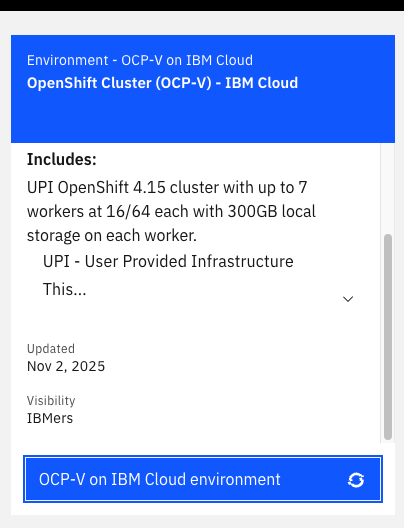
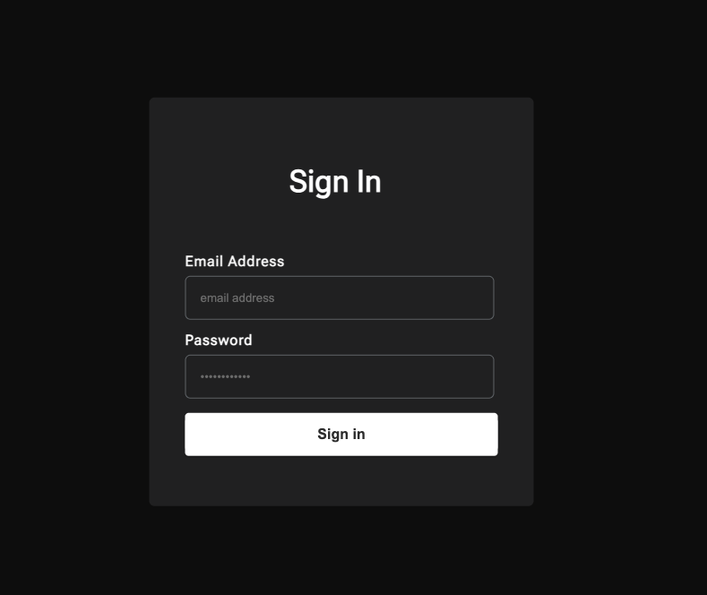
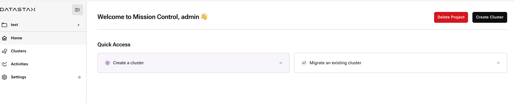

# Mission Control on OpenShift — Quick Install Guide

This guide walks through a clean install of Mission Control on OpenShift with fast, reliable defaults. It exposes the UI via an OpenShift Route using TLS passthrough, logs you in with a known admin user, and includes OpenShift-specific notes for creating your first Cassandra cluster (SCC on OCP). Observability components (Loki/Mimir/Grafana) are disabled initially for speed and can be enabled later.

### Prerequisites

- OpenShift cluster admin permissions and oc CLI
- Helm v3.12+ installed
- Access to the Mission Control Helm chart registry
- Files in this directory:
  - values-defaults.yaml (or values-full.yaml)
  - dex-reset.yaml (with a bcrypt hash for the admin password)
  - disable-observability.yaml (optional for first-time install)

Tip: To generate a bcrypt hash for dex-reset.yaml, see “Appendix: Generate a bcrypt hash”.

---
### Select VM from Techzone

### Select copy command from top right corner after logging into OpenShift Cluster Console

### Get Token to login into Openshift Cluster CLI

### Install Cert-Manager (required upstream Helm)
Mission Control uses cert-manager CRDs (Certificate, Issuer, ClusterIssuer). Install upstream cert-manager via Helm:

### Namespace
```bash
oc create namespace cert-manager || true
```
### Install CRDs
```bash
kubectl apply -f https://github.com/cert-manager/cert-manager/releases/download/v1.14.5/cert-manager.crds.yaml
```
### Helm repo and install
```bash
helm repo add jetstack https://charts.jetstack.io
helm repo update
helm upgrade --install cert-manager jetstack/cert-manager \
  --namespace cert-manager \
  --version v1.14.5
```

#** Verify CRDs and pods
```bash
oc get crd certificates.cert-manager.io issuers.cert-manager.io clusterissuers.cert-manager.io
oc get pods -n cert-manager
```

# Install Mission Control (fresh cluster)

This installs Mission Control into the mission-control namespace using your values files.

```bash
# Create namespace
oc new-project mission-control
# Run the following commands to grant access to Mission Control service accounts:
oc adm policy add-scc-to-user nonroot-v2 -z loki
oc adm policy add-scc-to-user nonroot-v2 -z mission-control
oc adm policy add-scc-to-user nonroot-v2 -z mission-control-agent
oc adm policy add-scc-to-user nonroot-v2 -z mission-control-aggregator
oc adm policy add-scc-to-user nonroot-v2 -z mission-control-cass-operator
oc adm policy add-scc-to-user nonroot-v2 -z mission-control-dex
oc adm policy add-scc-to-user nonroot-v2 -z mission-control-k8ssandra-operator
oc adm policy add-scc-to-user nonroot-v2 -z mission-control-kube-state-metrics
oc adm policy add-scc-to-user nonroot-v2 -z mission-control-mimir

# Install Mission Control
CHART_VERSION=1.15.0
helm upgrade --install mission-control \
  oci://registry.replicated.com/mission-control/mission-control \
  -n mission-control \
  -f values-defaults.yaml \
  -f dex-reset.yaml \
  -f disable-observability.yaml \
  --version ${CHART_VERSION}

# Watch pods
oc get pods -n mission-control
```

Notes:
- Use values-defaults.yaml (from “helm show values”) or values-full.yaml (from “helm get values”) as your baseline.
- dex-reset.yaml sets your admin password for Dex.
- disable-observability.yaml skips Loki/Mimir/Grafana during initial bring-up.

---

### Expose the UI (TLS passthrough via OpenShift Route)

The Mission Control UI serves HTTPS on port 8080. Name the Service port and configure the Route to passthrough TLS to the pod.

```bash
# Ensure the Service has a named port “https” targeting 8080
oc patch svc mission-control-ui -n mission-control \
  -p '{"spec":{"ports":[{"name":"https","port":8080,"protocol":"TCP","targetPort":8080}]}}'

# Create a Route if it doesn’t exist
oc get route mission-control-ui -n mission-control >/dev/null 2>&1 || \
  oc expose service mission-control-ui -n mission-control

# Set Route TLS to passthrough and target the “https” port
oc patch route mission-control-ui -n mission-control \
  -p '{"spec":{"tls":{"termination":"passthrough","insecureEdgeTerminationPolicy":"Redirect"},"port":{"targetPort":"https"}}}'
```

Print the UI URL and check router admission:

```bash
HOST=$(oc get route mission-control-ui -n mission-control -o jsonpath='{.spec.host}')
echo "Open Mission Control UI: https://${HOST}"

# Router should show True
oc get route mission-control-ui -n mission-control \
  -o jsonpath='{.status.ingress[0].conditions[?(@.type=="Admitted")].status}{"\n"}'
```

If your workstation can’t resolve the host (lab/non-DNS environment), temporarily map it to the router IP:

```bash
ROUTER_IP=$(oc get svc router-default -n openshift-ingress -o jsonpath='{.status.loadBalancer.ingress[0].ip}')
echo "${ROUTER_IP} ${HOST}" | sudo tee -a /etc/hosts
```

---

### Login to the UI

- Username: admin@example.com
- Password: the clear-text password you hashed in dex-reset.yaml

If login fails:
- Restart Dex and try again:
```bash
oc rollout restart deploy/mission-control-dex -n mission-control
oc rollout status  deploy/mission-control-dex -n mission-control
```

---

### Create a cluster (OpenShift SCC grant)
### Select create cluster button

On OpenShift, Cassandra pods may be blocked by the default SCC when they request fixed UIDs/FSGroup. After creating your cluster from the UI:

1) Identify which ServiceAccount the Cassandra StatefulSet uses (or assume mission-control if that’s your template default):
```bash
# Replace <cluster-ns> and <sts-name> accordingly
oc get sts -n <cluster-ns> <sts-name> -o jsonpath='{.spec.template.spec.serviceAccountName}{"\n"}'
```

2) Grant an SCC the SA can use (start with anyuid):
```bash
# Replace <sa-name> and <cluster-ns>
oc adm policy add-scc-to-user anyuid -z <sa-name> -n <cluster-ns>

# If it still fails with SCC errors, temporarily use privileged (tighten later):
# oc adm policy add-scc-to-user privileged -z <sa-name> -n <cluster-ns>
```

3) Recreate the first pod (or scale down/up) to pick up the SCC:
```bash
# Example for rack-0
oc delete pod -n <cluster-ns> <rack-sts-name>-0
# or:
oc scale sts -n <cluster-ns> <rack-sts-name> --replicas=0
oc scale sts -n <cluster-ns> <rack-sts-name> --replicas=1
```

---

### (Optional) Re-enable Observability

After initial success, enable Loki/Mimir/Grafana with proper object storage configuration (S3-compatible, GCS, etc.).

```bash
helm upgrade mission-control \
  oci://registry.replicated.com/mission-control/mission-control \
  -n mission-control \
  --reuse-values \
  --set loki.enabled=true \
  --set mimir.enabled=true \
  --set grafana.enabled=true \
  --version ${CHART_VERSION}
```

Tip: Configure storage and credentials for Loki/Mimir first to avoid CrashLoopBackOffs.

---

### Verify

```bash
# Helm release
helm list -n mission-control

# Core pods
oc get pods -n mission-control

# Route admitted should print True
oc get route mission-control-ui -n mission-control \
  -o jsonpath='{.status.ingress[0].conditions[?(@.type=="Admitted")].status}{"\n"}'
```

---

### Troubleshooting quick tips

- UI Route shows “Application is not available”:
  - Ensure the Service port is named “https”, targetPort=8080, and Route termination=passthrough.
  - Check NetworkPolicies in mission-control; allow from namespaceSelector label network.openshift.io/policy-group=ingress to port 8080.

- NodePort (30880) access fails:
  - Use the Route URL, or open port 30880 to worker nodes in your firewall/security groups.

- Cassandra pod forbidden due to SCC:
  - Add SCC anyuid (or privileged) to the Cassandra ServiceAccount in the cluster namespace, then recreate the pod.

- Dex password reset didn’t apply:
  - Ensure the bcrypt hash is quoted in dex-reset.yaml, apply via Helm, then restart Dex.

---

### Appendix: Generate a bcrypt hash (for Dex)

Pick one method (always quote the final hash in YAML).

- htpasswd (Linux/macOS):
```bash
# macOS: brew install httpd   |  RHEL/CentOS: sudo yum install httpd-tools
# Ubuntu/Debian: sudo apt-get install apache2-utils
HTPASS=$(htpasswd -nbBC 10 user 'NewStrongPassword!' | cut -d: -f2); echo "$HTPASS"
```

- Docker:
```bash
PW='NewStrongPassword!'
docker run --rm -e PW="$PW" httpd:2.4-alpine sh -lc 'htpasswd -nbBC 10 user "$PW" | cut -d: -f2'
```

- Python (if bcrypt is installed):
```bash
python3 - <<'PY'
import bcrypt
print(bcrypt.hashpw(b'NewStrongPassword!', bcrypt.gensalt(rounds=10)).decode())
PY
```

---

### Appendix: Example values files

dex-reset.yaml
```yaml
dex:
  config:
    enablePasswordDB: true
    staticPasswords:
      - email: admin@example.com
        hash: '$2y$10$REPLACE_ME_WITH_YOUR_BCRYPT_HASH'
        userID: 00000000-0000-0000-0000-000000000001
        username: admin
```

disable-observability.yaml
```yaml
loki:
  enabled: false

mimir:
  enabled: false

grafana:
  enabled: false
```

values-defaults.yaml
- Get the upstream defaults:
```bash
helm show values oci://registry.replicated.com/mission-control/mission-control \
  --version 1.15.0 > values-defaults.yaml
```
- Or capture your current release’s computed values:
```bash
helm get values mission-control -n mission-control --all > values-full.yaml
```

---
